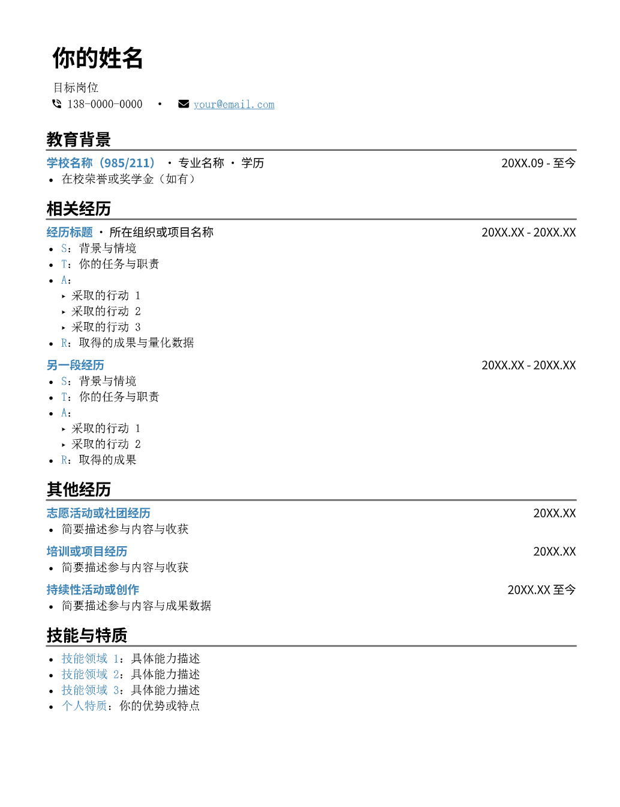

# Typst 简历模板

基于 [Typst](https://typst.app/) 的中文个人简历模板，排版美观，修改方便。



## 快速开始

**1. 获取项目**

```bash
git clone https://github.com/Zooms233/personal-resume-template.git
```

或直接下载 ZIP 解压。

**2. 选择编辑器并安装插件**

本模板使用 Typst 语言编写，主流编辑器通过插件即可支持实时预览和编译，**无需额外安装 Typst 命令行工具**。

### 编辑器推荐

| 适合人群 | 编辑器 | 说明 |
|---------|--------|------|
| 熟悉 API 调用的用户 | **VS Code** | 安装 [Tinymist Typst](https://marketplace.visualstudio.com/items?itemName=myriad-dreamin.tinymist) 插件，可自行接入 DeepSeek API 等 AI 辅助编辑 |
| 不熟悉 API 调用的用户 | **[Trae](https://trae.ai)** | 安装同样的 Tinymist Typst 插件，Trae 内置免费 AI，开箱即用，无需配置 |

> Trae 是字节跳动推出的 AI IDE，基于 VS Code 架构，内置免费 AI 助手，对新手非常友好。

**3. 编辑简历并预览**

- 用编辑器打开项目文件夹
- 打开 `简历模板.typ` 开始编辑
- Tinymist 插件会提供实时预览，保存即刷新

**4. 导出 PDF**

编辑完成后，通过 Tinymist 插件的导出功能即可生成 PDF。

## 项目结构

```
.
├── resume-template.typ   # 模板库（不要修改）
└── 简历模板.typ           # 你的简历内容（编辑这个文件）
```

## 填写简历

简历内容的填写和修改，可以直接询问编辑器里的 AI 助手。例如：

- "帮我把教育背景改成 XX 大学计算机科学专业"
- "用 STAR 法则帮我润色这段项目经历"
- "我想加一段实习经历，帮我写模板"
